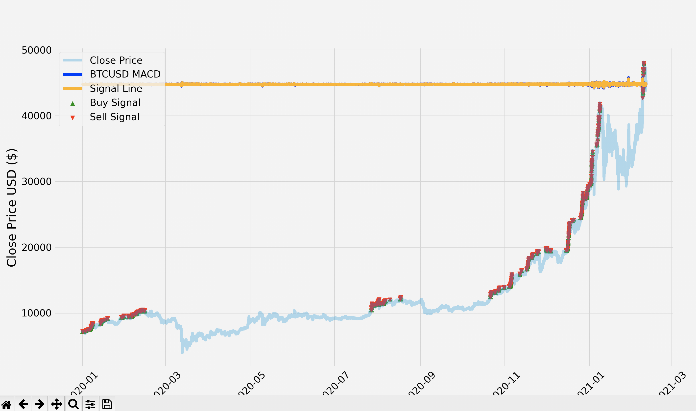

# Crypto Bot

Simple bot to automate crypto trades. Has full account integration via the Coinbase Pro API, with the ability to track account balances and place trades via a Coinbase Pro API key. Market data is managed with `numpy` and `pandas`, and `requests` is used to send HTTP requests to the API. Unit tests implemented using `pytest` and `requests-mock`. API keys managed using `dotenv`.

## Disclaimer

This project is for educational purposes, and I am not responsible for any financial losses incurred during use of this bot.

## Installation

This project uses `pip` and `setuptools` for package management. To install, first clone the repository. If you do not have `pip`, you must first install it (see instructions [here](https://pip.pypa.io/en/stable/installing/)). `Setup.py` defines an installation routine for the `crypto-bot` package. Initialize it by running `pip install -e .`. This will additionally install the latest version of all required libraries. If you wish to download a more strictly versioned set of dependencies (i.e. for production purposes), you can run `pip install -r requirements.txt`.

## Usage

After installing the `crypto-bot` package, you must create an account and API key via the [Coinbase Pro UI](https://pro.coinbase.com/profile/api). I would recommend creating a [sandbox API key](https://public.sandbox.pro.coinbase.com/profile/api) first, for testing and demo purposes. Next, create a `.env` file with 3 line-separated environment variables (API_SECRET, API_KEY, API_PASS) declared as follows: API_SECRET=XXX. The `bot` script command will start running the trading bot. The bot will continue indefinitely until manually stopped. There is limited UI feedback provided via terminal to track the bot's activity. In order to switch from the Coinbase Pro sandbox environment to the production environment, change the `api_url` constant in the `bot/__main__.py` file. The `time.sleep` statement at the bottom of that file determines how often market data is pulled from the API. It is currently configured to poll the API every second to allow for expedited debugging, but you may want to increase the interval for a more realistic trading experience.

## Analysis

The bot's trading strategy revolves around the MACD indicator, which consists of the MACD line (difference between the 12 and 26 day price EMA) and a signal line (9 day EMA of the MACD line). When the MACD crosses above the signal line, the bot will attempt to open a long position in BTC. When the MACD crosses below the signal and BTC is currently held, the bot will attempt to sell all held BTC as long as the current bid price is above the cost basis + fees. By doing this, the bot should theoretically never sell at a loss. In order to test this strategy, I created a simplified implementation that manipulated BTCUSD 1 minute data from Feb 2020 to Feb 2021. Backtesting revealed an annualized return of about 444% for this time frame, but it should be noted that 2020 was certainly a bull market for crypto. Below is a visualization of this backtesting process created using `matplotlib`.

## Testing

The package contains a set of unit tests for utility functions. In order to run them, use the `pytest` command. These unit tests are not meant to be comprehensive, but test both successful and failing cases for most package utility functions.

## License

Licensed under MIT license. Copyright (c) 2021 Christopher Nathan.